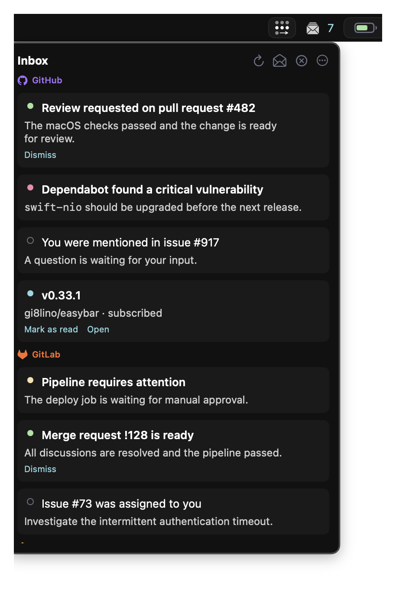

<div class="easybar-hero" markdown>

<p class="easybar-hero__eyebrow">Native where it matters. Scriptable where you want it.</p>

# A macOS status bar that fits your workflow

EasyBar combines polished SwiftUI widgets with a Lua runtime, installable packages, and a practical
CLI. Start with useful defaults, then shape every part of the bar around how you work.

[Get started](getting-started/quick-start.md){ .md-button .md-button--primary }
[Browse widget packages](packages/catalog.md){ .md-button }
[View on GitHub](https://github.com/easybar-app/easybar){ .md-button }

[](assets/bar.png)

</div>

## Running in a minute

EasyBar works without a custom configuration. Install it with Homebrew and open the app:

```bash
brew tap easybar-app/tap
brew install --cask easybar-app/tap/easybar
open -a EasyBar
```

The default bar includes spaces, battery, Wi-Fi, and calendar widgets. Follow the
[Quick Start](getting-started/quick-start.md) when you are ready to customize it.

## Built for the space between native and scriptable

<div class="grid cards" markdown>

- :material-apple:{ .lg .middle } **Native macOS experience**

  ***

  SwiftUI rendering, native context menus, calendar and network integrations, and a menu bar
  controller feel at home on macOS.

  [Explore built-ins](configuration/builtins.md)

- :material-code-braces:{ .lg .middle } **Lua when you need it**

  ***

  Build custom widgets with events, timers, asynchronous commands, popups, groups, and persistent
  settings—without rebuilding the app.

  [Create your first widget](lua/guides/first-widget.md)

- :material-package-variant-closed:{ .lg .middle } **Installable packages**

  ***

  Discover and install independently versioned widgets and reusable Lua libraries from the
  optional package registry.

  [Browse packages](packages/catalog.md)

- :material-tune-variant:{ .lg .middle } **Designed to be yours**

  ***

  Configure placement, groups, themes, built-ins, and behavior in TOML, then apply changes from
  the CLI without restarting your workflow.

  [Configure EasyBar](configuration/overview.md)

</div>

## Choose the right extension point

| Use              | Best for                                                                          | Start here                             |
| ---------------- | --------------------------------------------------------------------------------- | -------------------------------------- |
| Native built-ins | Spaces, battery, Wi-Fi, calendar, time, date, volume, and front-app state         | [Built-ins](configuration/builtins.md) |
| Lua widgets      | Custom display logic, commands, interactions, popups, and project-specific status | [Lua Widgets](lua/overview.md)         |
| Widget packages  | Ready-made integrations and reusable Lua libraries                                | [Package Catalog](packages/catalog.md) |
| CLI              | Reloads, diagnostics, inbox publishing, package management, and automation        | [CLI Reference](runtime/cli.md)        |

## See EasyBar in action

<div class="easybar-showcase" markdown>

<figure markdown>
[{ .screenshot-compact .screenshot-month }](assets/month.png)
<figcaption>Calendar month view with event indicators</figcaption>
</figure>

<figure markdown>
[{ .screenshot-compact .screenshot-upcoming }](assets/upcoming.png)
<figcaption>A compact agenda for upcoming events</figcaption>
</figure>

<figure markdown>
[{ .screenshot-compact .screenshot-inbox }](assets/inbox.png)
<figcaption>One actionable inbox for multiple sources</figcaption>
</figure>

<figure markdown>
[{ .screenshot-compact .screenshot-wifi }](assets/wifi.png)
<figcaption>Native network details at a glance</figcaption>
</figure>

</div>

## Go further

- Integrate AeroSpace workspaces and focused-app state with [Spaces](configuration/builtins/spaces.md).
- Create a cohesive layout with [Native Groups](configuration/native-groups.md) and [Themes](configuration/themes.md).
- Publish actionable notifications through the shared [Inbox](configuration/builtins/inbox.md).
- Diagnose startup, permissions, and runtime issues with [Troubleshooting](runtime/troubleshooting.md).
- Understand the process model and extension boundaries in [Internals](internals/overview.md).

<div class="easybar-home-cta" markdown>

### Make the bar work the way you do

Install EasyBar, keep the useful defaults, and customize only what makes your workflow better.

[Start with EasyBar](getting-started/quick-start.md){ .md-button .md-button--primary }

</div>
